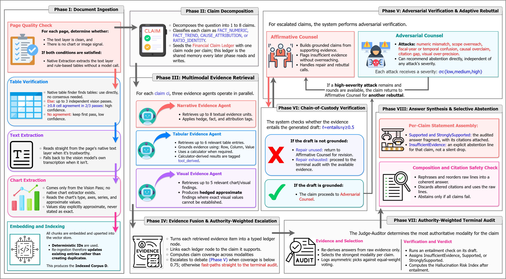
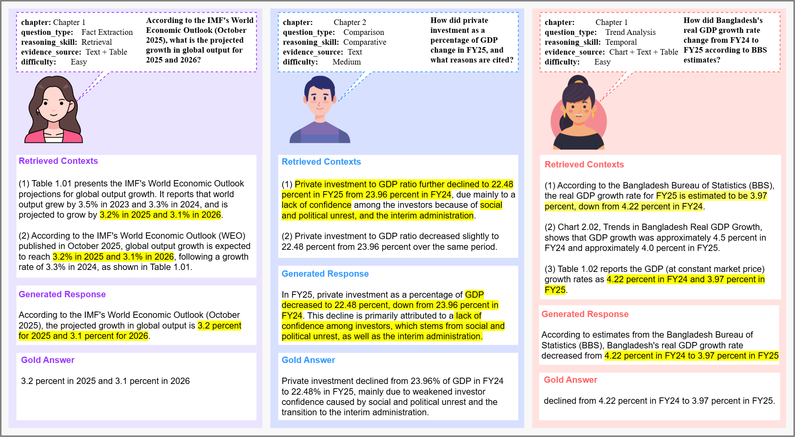

# CLAIR-Fin

**Claim-Ledger Adversarial Inference and Retrieval for Financial document understanding**

CLAIR-Fin is a nine-agent framework for faithful question answering over long, multimodal
financial documents, where the same fact may appear as prose, a table, and a chart that do not
always agree. Each question is decomposed into atomic, typed **claims** held in a *Financial
Claim Ledger*; every claim is resolved through modality-aware evidence weighting, hand-off
grounding checks, adaptive adversarial debate, and a terminal entailment audit, and the system
abstains when evidence is insufficient rather than forcing an unsupported answer.

On **BB-FinQA-X** (500 cross-modal questions from the Bangladesh Bank Annual Report), CLAIR-Fin
raises faithfulness from **0.780 → 0.889** over a single-pass RAG baseline and outperforms
stronger retrieval baselines such as HyDE and Graph-RAG, while abstaining on 5.4% of questions.

- 📄 Paper: https://arxiv.org/abs/2608.13706
- 🤗 Dataset: https://huggingface.co/datasets/Fatema142/BB-FinQA-X



---

## Core idea

Prior work addresses one piece of the problem in isolation; CLAIR-Fin combines four mechanisms:

| Mechanism | What it does | Why it matters |
|---|---|---|
| **AEA** – Asymmetric Evidence Authority | Conditions evidence trust on claim type (table cells for exact figures, prose for causal attribution) instead of treating all modalities equally | Resolves cross-modal disagreement by a stated, auditable prior |
| **CoCV** – Chain-of-Custody Verification | Checks grounding at the hand-off between drafting and adversarial review, not only at the pipeline's exit | Stops attribution drift before it propagates |
| **ARC** – Adaptive Rebuttal Cycle | Routes only contested claims (coverage `< 0.75`) to adversarial debate; depth scales with what the debate finds (max 2 rounds) | Spends compute on the claims most likely to be wrong |
| **HRI** – Hallucination Risk Index | Continuous per-claim risk score paired with the binary audit verdict | Distinguishes claims that survived scrutiny from claims never contested |

---

## Dataset: BB-FinQA-X

500 English question–answer pairs grounded in the Bangladesh Bank Annual Report, hand-written and
validated in a three-stage protocol (author drafting → independent review → external
banking-sector domain validation → mandatory consensus). Each item records its supporting evidence
(text passage / table cell / chart element) and source page, and is stratified along three
controlled dimensions.

**By query type × difficulty**

| Query Type | Easy | Medium | Hard | Total |
|---|--:|--:|--:|--:|
| Fact Extraction | 70 | 65 | 15 | 150 |
| Comparison | 35 | 75 | 25 | 135 |
| Trend Analysis | 20 | 35 | 10 | 65 |
| Numerical Calculation | 15 | 35 | 10 | 60 |
| Multi-hop Reasoning | 10 | 30 | 10 | 50 |
| Evidence Retrieval | 25 | 10 | 5 | 40 |
| **Total** | **175** | **250** | **75** | **500** |

**By presentation format × difficulty**

| Format | Easy | Medium | Hard | Total |
|---|--:|--:|--:|--:|
| Text Only | 35 | 50 | 15 | 100 |
| Table Only | 35 | 50 | 15 | 100 |
| Chart Only | 18 | 25 | 7 | 50 |
| Text + Table | 52 | 75 | 23 | 150 |
| Text + Chart | 18 | 25 | 7 | 50 |
| Table + Chart | 17 | 25 | 8 | 50 |
| **Total** | **175** | **250** | **75** | **500** |

Text Only / Table Only and Chart Only / Text + Chart are **matched content pairs** (same
indicator, query type, and difficulty; different evidence format), enabling controlled format
comparisons.



---

## Methodology

A question flows through eight phases (see the workflow diagram above):

| Phase | Agent(s) | Role |
|---|---|---|
| I. Ingestion | *(offline)* | Per-page native or vision extraction of text/tables/charts; tables extracted 3× with agreement check; sentence-aware chunking into a Milvus store |
| II. Claim Decomposition | Planner-Orchestrator | Split the question into 1–8 atomic, typed claims (`FACT_NUMERIC`, `FACT_TREND`, `CAUSE_ATTRIBUTION`, `RATIO_IDENTITY`) |
| III. Evidence Retrieval | Narrative / Tabular / Visual | Modality-specific retrieval (k = 8 / 6 / 5), blended dense + lexical scoring; ground cells and spans, derive metrics deterministically |
| IV. Fusion & Escalation | Ledger Guardian | Merge evidence into the ledger, link same-metric nodes; compute AEA **coverage** `A(cᵢ)`; escalate iff `A(cᵢ) < 0.75` |
| V. Adversarial Rebuttal | Affirmative + Adversarial Counsel | Draft, then attack across 6 categories (numeric, scope, fiscal-year, causal overclaim, citation gap, visual over-precision); rebut while high-severity findings remain (≤ 2 rounds) |
| VI. Chain-of-Custody | *(reuses Judge-Auditor)* | Entailment check at the drafting→review hand-off; one bounded repair, else custody marked broken |
| VII. Terminal Audit | Judge-Auditor | Authority-weighted argmax over modality confidence; entailment gate; log equal-weight counterfactual to the Authority Docket; compute HRI |
| VIII. Synthesis | Brief Synthesizer | Compose one cited answer; abstain iff no claim passed audit |

**Asymmetric Evidence Authority weights** `w(τ, m)` (fixed design prior, rows sum to 1):

| Claim type | table | tool_derived | text | chart |
|---|--:|--:|--:|--:|
| FACT_NUMERIC | 0.55 | 0.30 | 0.10 | 0.05 |
| FACT_TREND | 0.45 | – | 0.10 | 0.45 |
| CAUSE_ATTRIBUTION | 0.25 | – | 0.75 | – |
| RATIO_IDENTITY | 0.40 | 0.60 | – | – |

**Stack:** Python · LangGraph `StateGraph` (9 agents as nodes) · LangChain · Milvus Lite ·
OpenAI `gpt-4o` (all agents + vision) · `text-embedding-3-large`. Every threshold and weight is
externally configurable via `configs/settings.py` and two YAML files (`agent_budgets.yaml`,
`aea_weights.yaml`).

---

## Results (BB-FinQA-X, n = 500)

**RAGAS metrics — CLAIR-Fin vs. ablations and retrieval baselines**

| Configuration | Faith. ↑ | Ans. Rel. ↑ | Ctx. Prec. ↑ | Ctx. Recall ↑ |
|---|--:|--:|--:|--:|
| **CLAIR-Fin** | **0.889** | **0.696** | **0.816** | **0.897** |
| w/o Terminal Audit | 0.845 | 0.687 | 0.803 | 0.886 |
| w/o ARC (debate) | 0.770 | 0.680 | 0.781 | 0.862 |
| w/o AEA | 0.883 | 0.692 | 0.812 | 0.893 |
| w/o CoCV | 0.857 | 0.689 | 0.807 | 0.881 |
| Vanilla RAG | 0.780 | 0.680 | 0.700 | 0.840 |
| HyDE RAG | 0.874 | 0.691 | 0.801 | 0.885 |
| Hierarchical RAG | 0.865 | 0.688 | 0.752 | 0.831 |
| Graph-RAG | 0.832 | 0.694 | 0.729 | 0.889 |

**Framework-specific metrics**

| Configuration | Faith. Rate ↑ | Exact Corr. ↑ | Coverage ↑ | Debate Util. | AEA Impact |
|---|--:|--:|--:|--:|--:|
| **CLAIR-Fin** | **0.783** | **0.592** | **0.946** | **0.646** | **0.515** |
| w/o Terminal Audit | 0.741 | 0.561 | 0.935 | 0.639 | 0.509 |
| w/o ARC | 0.682 | 0.524 | 0.896 | – | 0.501 |
| w/o AEA | 0.776 | 0.585 | 0.940 | 0.644 | – |
| w/o CoCV | 0.753 | 0.548 | 0.922 | 0.641 | 0.508 |

Answer outcomes: **59.2%** correct / 23.6% partial / 11.8% incorrect / **5.4%** abstained.
HRI–correctness correlation: −0.072 (expected direction, adds signal at the margin).

**RAGAS by presentation format** (sample-weighted)

| Format | n | Faith. ↑ | Ans. Rel. ↑ | Ctx. Prec. ↑ | Ctx. Recall ↑ |
|---|--:|--:|--:|--:|--:|
| Text Only | 100 | 0.870 | 0.675 | 0.795 | 0.878 |
| Table Only | 100 | 0.900 | 0.705 | 0.830 | 0.912 |
| Chart Only | 50 | 0.850 | 0.665 | 0.775 | 0.847 |
| Text + Table | 150 | 0.915 | 0.725 | 0.845 | 0.925 |
| Text + Chart | 50 | 0.875 | 0.685 | 0.805 | 0.887 |
| Table + Chart | 50 | 0.880 | 0.675 | 0.795 | 0.881 |

**RAGAS by query type** (sample-weighted)

| Query Type | n | Faith. ↑ | Ans. Rel. ↑ | Ctx. Prec. ↑ | Ctx. Recall ↑ |
|---|--:|--:|--:|--:|--:|
| Fact Extraction | 150 | 0.920 | 0.735 | 0.855 | 0.928 |
| Comparison | 135 | 0.900 | 0.710 | 0.825 | 0.908 |
| Trend Analysis | 65 | 0.885 | 0.685 | 0.805 | 0.892 |
| Numerical Calculation | 60 | 0.865 | 0.665 | 0.785 | 0.875 |
| Multi-hop Reasoning | 50 | 0.840 | 0.625 | 0.755 | 0.835 |
| Evidence Retrieval | 40 | 0.839 | 0.656 | 0.780 | 0.862 |

**Human evaluation** — two external banking-sector domain experts, blind to system confidence
(1–5 scale, quadratic weighted Cohen's κ):

| Dimension | Eval 1 | Eval 2 | κ |
|---|--:|--:|--:|
| Correctness | 4.18 | 4.05 | 0.82 |
| Faithfulness | 4.34 | 4.21 | 0.85 |
| Citation Quality | 4.11 | 3.98 | 0.80 |
| Clarity | 4.39 | 4.27 | 0.87 |
| Abstention Appropriateness | 4.06 | 3.95 | 0.84 |
| Overall Quality | 4.22 | 4.09 | 0.84 |

**Takeaways:** removing **ARC** hurts most (0.889 → 0.770) — targeted debate is the single most
consequential mechanism; the **terminal audit** carries more of the faithfulness guarantee than
any upstream check, but **CoCV** still contributes independently; **AEA** changes the winning
modality in ~52% of contested decisions; chart-dependent evidence and synthesis-heavy query types
(Evidence Retrieval, Multi-hop) remain hardest.

---

## Installation

Requires Python ≥ 3.12 and an OpenAI API key.

```bash
git clone https://github.com/fatemafaria142/CLAIR-Fin
cd CLAIR-Fin
pip install -r requirements.txt          # or: uv sync
```

Create a `.env` file in the project root with: `OPENAI_API_KEY` (required),
`OPENAI_MODEL` (default `gpt-4o-mini`), `OPENAI_VISION_MODEL`,
`EMBEDDING_MODEL` (default `text-embedding-3-large`).

## Usage

```bash
# 1. Ingest source PDFs — drop them in data/ first
python -m clairfin.ingestion.ingest

# 2. Ask a single question
python -m clairfin.graph.run "What was the point-to-point CPI inflation rate in FY2024?"

# 3. Serve the pipeline as an API  (POST /api/query)
uvicorn server.main:app --reload

# 4. Reproduce evaluation for a chapter
python -m evaluation.generate_responses --chapter 3
python -m evaluation.run_rag_metrics --chapter 3        # Table 1: RAGAS + ranking metrics
python -m evaluation.run_clairfin_metrics --chapter 3   # Table 2: framework-specific metrics
```

Each run writes the full audit trail — ledger graph, custody log, Authority Docket, and a
human-readable answer report — to `results/<run_id>/`.

## Repository layout

```
clairfin/
  agents/        9 agents (planner, 3 evidence, guardian, 2 counsel, custody, judge, synthesizer)
  graph/         LangGraph state machine (build.py) and run entry point (run.py)
  ingestion/     PDF → text/table/chart extraction, chunking, Milvus upsert
  retrieval/     modality-filtered dense + lexical retriever
  ledger/        ClaimLedger evidence graph with JSON persistence
  schemas/       Pydantic models (claims, evidence, AEA, ledger, state)
  tools/         calculator, entailment, custody, AEA scorer, HRI, authority docket
configs/         settings.py + aea_weights.yaml, agent_budgets.yaml, pricing.yaml
prompts/         agent and tool prompt templates
evaluation/      gold data loading, response generation, Table 1 / Table 2 scoring
ablation-study/  HyDE, Hierarchical, and Graph-RAG retrieval baselines
server/          FastAPI app
```

## Citation

```bibtex
@misc{faria2026clairfinadversarialmultiagentframework,
  title         = {CLAIR-Fin: An Adversarial Multi-Agent Framework for Claim-Level
                   Verification and Adaptive Debate in Cross-Modal Financial QA},
  author        = {Fatema Tuj Johora Faria and Mukaffi Bin Moin and Jubayer Al Mahmud
                   and M. F. Mridha and Md. Alam Hossain},
  year          = {2026},
  eprint        = {2608.13706},
  archivePrefix = {arXiv},
  primaryClass  = {cs.CL},
  url           = {https://arxiv.org/abs/2608.13706}
}
```

## License

See [`LICENSE`](LICENSE).
